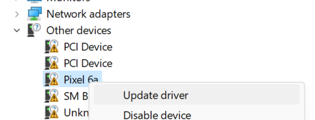

# Pixelated
Pixelated is a user-friendly tool that simplifies the process of flashing images on Pixel devices. With just a few clicks, users can easily install stock or custom images on their supported Pixel devices.
This repository and all branches are experimental for now.

## Features
- Select from various channels to view available images for your device
- Download and install images with ease
- Supports a wide range of Pixel devices (Pixel 2 and up)

## Getting Started
1. Clone the Pixelated repository
2. Install Fastboot by following the instructions below:
3. Install drivers on Windows

### Installing Fastboot

**Windows:**
- Download: https://developer.android.com/tools/releases/platform-tools
- Extract to C:\platform-tools
- Run PowerShell as Administrator and type: `setx PATH "%PATH%;C:\platform-tools"`

**Mac:**
- Run `brew install --cask android-platform-tools`

**Linux (via APT):**
- Run `sudo apt-get install android-tools-adb -y`

3. Install the required dependencies
4. Run the Pixelated application

### Pixel Drivers for Windows
If you're using Pixelated on a Windows machine, you may need to install the Pixel drivers to ensure proper connectivity with your Pixel device. Follow these steps to install the Pixel drivers:

1. Open the Device Manager on your Windows machine.

2. Find your Pixel device in the list and right-click on it. Select "Update driver" from the context menu.
   

3. In the Update Driver Software window, select "Browse my computer for drivers."
   

4. Navigate to the folder containing the Pixel drivers you downloaded from the following link:
   [Pixel Drivers](https://developer.android.com/studio/run/win-usb)
   

5. Select the folder and click "Install" to install the drivers.
   

After completing these steps, your Pixel device should be recognized and ready for use with Pixelated.
